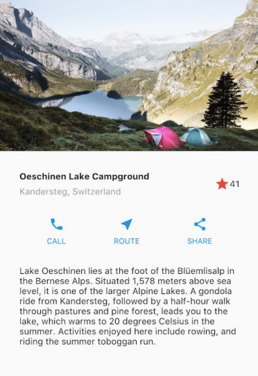
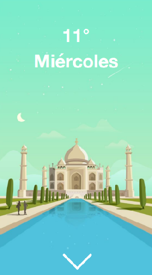
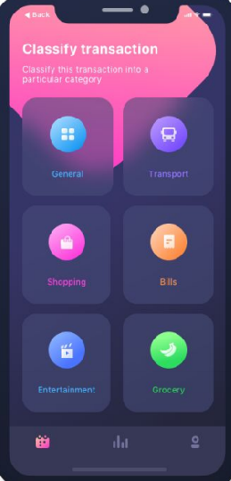

# desings

El objetivo principal de la sección es simple:

Desarrollar la visión para transformar un diseño previamente creado, en una aplicación de Flutter.

Realizaremos 3 estilos:

### Básico - recomendado por Flutter

Intermedio - Con PageViews e imágenes

Avanzado - Con blur, grids background y más.

